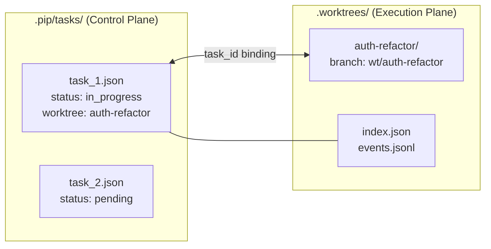

# Worktree Task Isolation

## Problem

All agents share a single `WORKDIR`. Two agents editing the same file simultaneously -> uncommitted changes pollute each other.

## Architecture



- **Control plane** (`.pip/tasks/`): PlanManager manages task state as before
- **Execution plane** (`.worktrees/`): WorktreeManager manages isolated directories; worktree subdirectories live here
- **Binding point**: worktree auto-created on `claim_task`, cleaned up on task completion

## State Machines

```
Task:      pending -> in_progress -> completed
Worktree:  absent  -> active      -> removed | kept
```

## Key Design Decisions

- **Creation**: Automatically after `claim_task` succeeds (graceful fallback if not a git repo)
- **Cleanup**: Automatic `git worktree remove` when `task_update` marks a task `completed`
- **Branch naming**: `wt/{task_id}`, base = HEAD
- **workdir propagation**: Add `workdir` keyword parameter to tool runners (default None -> WORKDIR); dispatch layer forwards it
- **safe_path fence = worktree**: When any agent works in a worktree, path safety checks fence to that worktree directory, not the deployment root WORKDIR -- prevents cross-worktree or deployment-root modifications
- **Lead also uses worktrees**: Lead gets an isolated worktree after claiming a task; `agent_loop` tracks `current_workdir` and passes it to `ToolContext`. The deployment root is used only for infrastructure (`.pip/tasks/`, `.pip/` etc); all code modifications happen inside worktrees

## New Files

### 1. `src/pip_agent/worktree.py` -- WorktreeManager

Core class managing git worktree lifecycle under `.worktrees/`.

- `__init__(root: Path, repo_dir: Path)` -- root is `.worktrees/`, repo_dir is the main repository
- `create(task_id: str, base: str = "HEAD") -> Path` -- runs `git worktree add -b wt/{task_id} .worktrees/{task_id} {base}`, returns worktree path
- `remove(task_id: str) -> bool` -- `git worktree remove`; returns False and logs on failure (e.g. uncommitted changes)
- `get_path(task_id: str) -> Path | None` -- query active worktree path
- `_update_index(task_id, entry)` / `_load_index()` -- persist to `index.json`
- `_log_event(task_id, event, detail)` -- append-only `events.jsonl`
- Thread-safe (`threading.Lock`)

```python
@dataclass
class WorktreeEntry:
    task_id: str
    directory: str
    branch: str
    status: Literal["active", "removed", "kept"]
    created_at: str
```

### 2. `tests/test_worktree.py`

- Git repo fixture (`tmp_path` + `git init` + initial commit)
- `test_create` / `test_remove` / `test_get_path` / `test_create_no_git_fallback`
- `test_index_persistence` / `test_events_logged`

## Modified Files

### 3. `src/pip_agent/tools.py` -- workdir Parameter Injection

Add `workdir: Path | None = None` keyword parameter to `safe_path`, `run_bash`, `run_read`, `run_write`, `run_edit`, `run_glob`:

```python
def safe_path(raw: str, workdir: Path | None = None) -> Path:
    wd = workdir or WORKDIR
    resolved = (wd / raw).resolve()
    if not resolved.is_relative_to(wd):
        raise ValueError(f"Path escapes working directory: {raw}")
    return resolved

def run_bash(tool_input: dict, *, workdir: Path | None = None) -> str:
    ...
    result = subprocess.run(..., cwd=workdir or WORKDIR, ...)
```

Default None -> WORKDIR; all existing callers remain unchanged.

### 4. `src/pip_agent/tool_dispatch.py`

**ToolContext** -- two new fields:

```python
@dataclass
class ToolContext:
    ...
    workdir: Path | None = None
    worktree_manager: WorktreeManager | None = None
```

**DispatchResult** -- new field:

```python
@dataclass
class DispatchResult:
    ...
    workdir: Path | None = None   # claim_task returns new worktree path
```

**`_wrap_simple`** forwards workdir:

```python
def _wrap_simple(run, inp, workdir=None):
    try:
        return run(inp, workdir=workdir)
    except ...
```

**`_handle_bash`** forwards workdir (background tasks use `functools.partial`):

```python
def _handle_bash(ctx, inp):
    if inp.get("background") and ctx.bg_manager:
        fn = partial(run_bash, workdir=ctx.workdir) if ctx.workdir else run_bash
        ctx.bg_manager.spawn(task_id, inp["command"], fn, inp)
        ...
    return DispatchResult(content=_wrap_simple(run_bash, inp, ctx.workdir))
```

**`_handle_claim_task`** creates worktree:

```python
def _handle_claim_task(ctx, inp):
    # ... existing claim logic ...
    workdir = None
    if ctx.worktree_manager is not None:
        try:
            wt_path = ctx.worktree_manager.create(inp["task_id"])
            workdir = wt_path
            result += f"\nWorktree: {wt_path}"
        except Exception:
            pass  # graceful fallback
    return DispatchResult(content=result, used_task_tool=True, workdir=workdir)
```

**`task_update` handler** cleans up worktree (extracted from `_make_task_handler`):

```python
def _handle_task_update(ctx, inp):
    # ... existing update logic ...
    if ctx.worktree_manager:
        for entry in inp.get("tasks", []):
            if entry.get("status") == "completed":
                ctx.worktree_manager.remove(entry["id"])
    return DispatchResult(content=text, used_task_tool=True)
```

**Lambda handlers** forward `ctx.workdir`:

```python
"read": lambda ctx, inp: DispatchResult(content=_wrap_simple(run_read, inp, ctx.workdir)),
```

### 5. `src/pip_agent/team/__init__.py` -- Teammate Worktree Tracking

**Teammate**:

- New `_current_workdir: Path | None = None`
- `_exec_tool` passes `ToolContext(workdir=self._current_workdir, worktree_manager=self._worktree_manager)`
- New `_maybe_update_workdir(outcome: DispatchResult)`: sets `_current_workdir = outcome.workdir` on successful claim
- New `_maybe_clear_workdir(name, inp)`: resets `_current_workdir = None` when task_update marks a task completed
- `_system_prompt` dynamically reflects the current working directory

**Teammate init** accepts `worktree_manager: WorktreeManager | None`.

**TeamManager** receives `worktree_manager` at construction and passes it to each Teammate.

### 6. `src/pip_agent/config.py`

New field: `worktrees_dir: str = Field(default=".worktrees")`

### 7. `src/pip_agent/agent.py` -- Lead Worktree Tracking

- Create `WorktreeManager(WORKDIR / settings.worktrees_dir, WORKDIR)`
- Pass to `TeamManager(..., worktree_manager=worktree_manager)`
- `agent_loop` gains `current_workdir: Path | None = None` local state
- Build `ToolContext` with `workdir=current_workdir, worktree_manager=worktree_manager`
- After dispatch, check `outcome.workdir`; if not None, update `current_workdir`
- Reset `current_workdir = None` when `task_update` marks a task completed
- Optionally append current workdir path to system_prompt (so Lead knows which directory it is in)

### 8. `src/pip_agent/task_graph.py`

`Task` dataclass gains `worktree: str = ""` field, included in `to_dict` / `from_dict`. PlanManager does not use this field internally (pure metadata); set by the claim_task handler.

### 9. Test Updates

- `test_worktree.py`: Full WorktreeManager unit tests (needs git repo fixture)
- `test_tool_dispatch.py`: workdir parameter forwarding verification
- `test_team.py`: Teammate worktree tracking (claim -> workdir set -> complete -> workdir cleared)

## Out of Scope

- Merge-back workflow within worktrees (agents handle commit/push/PR themselves)
- Concurrent worktree cleanup scheduling
- Subagent worktree support (subagents are currently only used by Lead)
- Migrating Pip from "running in its own source directory" to "installed as a package in target repo" (this plan only ensures the worktree design is forward-compatible)
